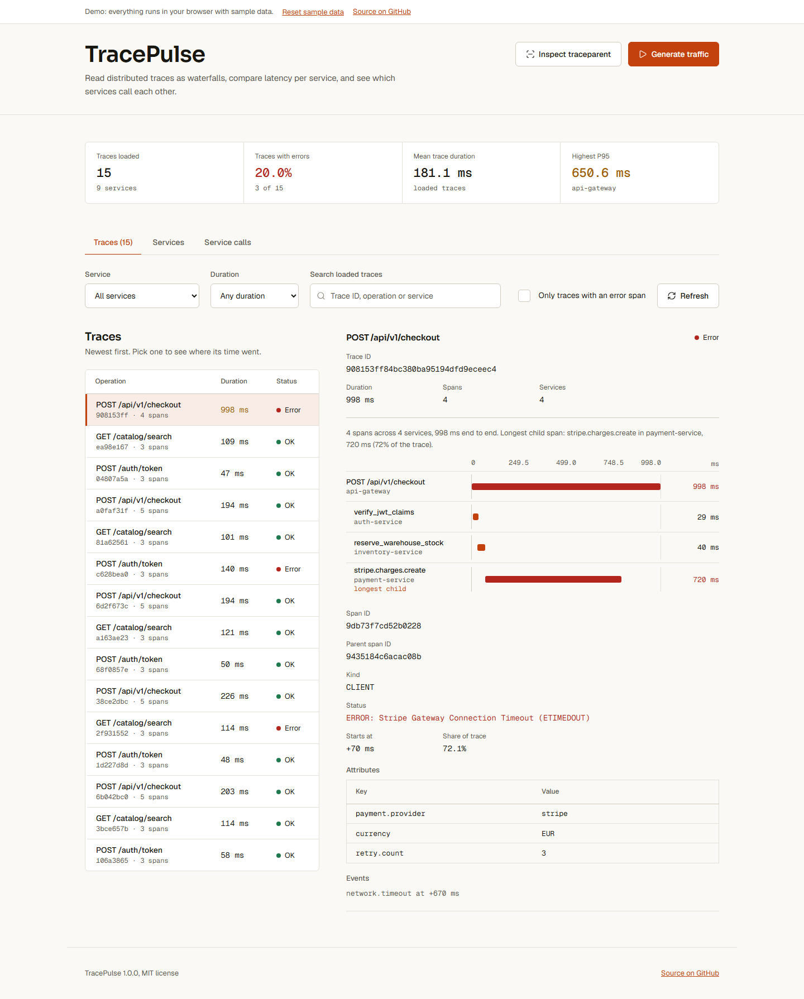

# TracePulse

TracePulse is a trace viewer. It ingests spans over a REST API, stores them in SQLite, and shows each trace as a waterfall, with latency percentiles per service and a table of which services call each other. It is meant for people who run a handful of services and want to read their traces without setting up a tracing backend.

[](https://github.com/Taan1el/tracepulse/actions/workflows/ci.yml)
[](https://github.com/Taan1el/tracepulse/actions/workflows/pages.yml)
[](LICENSE)

**Live demo:** https://taan1el.github.io/tracepulse/

The demo runs entirely in your browser: the same trace-building, percentile and dependency code the server uses runs against 15 generated sample traces (the same 15 every visit), so it works with no backend.

## Screenshot



More screenshots: [latency per service](docs/screenshots/02-services.png), [calls between services](docs/screenshots/03-calls.png), [the app at phone width](docs/screenshots/04-mobile.png).

## Features

- **Span ingestion**: `POST /api/traces` takes OpenTelemetry-style span records, validates the whole batch, and stores the trace and its spans in one transaction.
- **Trace table and waterfall**: traces newest first, filterable by service, minimum duration and error spans, with a text search over the loaded traces. The waterfall is a flat bar diagram of every span's offset and duration, with a text summary, and each span expands to its IDs, attributes and events. The longest non-root span is marked as the longest child.
- **Latency per service**: average, P50, P90, P95 and P99 plus error rate for every service, computed over all stored spans.
- **Service calls**: a table of caller, callee, call count, average duration and errors, found from parent and child spans that belong to different services.
- **W3C `traceparent` tools**: parse and validate a header, get the header a downstream call would send, or generate a fresh context.
- **Traffic generator**: creates sample checkout, sign-in and search traces, with an option to make a trace fail.
- **Demo mode**: a static build for GitHub Pages with deterministic sample data and a "Reset sample data" control.

## Getting started

### Prerequisites
- Node.js 22.13 or newer (`node:sqlite` is used without a flag from 22.13; CI runs Node 22 and 24)
- npm 10 or newer

### Install
```bash
git clone https://github.com/Taan1el/tracepulse.git
cd tracepulse
npm install
```

### Run
```bash
npm run dev
```
The API listens on http://localhost:4000 and the Vite dev server on http://localhost:5173 (it proxies `/api`). The first start seeds 15 sample traces into `server/data/tracepulse.db`.

For a production-style run, build once and start the server, which also serves the built client:
```bash
npm run build
npm start --workspace=server   # http://localhost:4000
```

### Environment variables

| Variable | Where | Default | Purpose |
|---|---|---|---|
| `PORT` | server | `4000` | Port the Express server listens on. Invalid values fall back to the default. |
| `VITE_API_TARGET` | client dev server | `http://localhost:4000` | Where the Vite dev server proxies `/api`. Set it in `client/.env.local`. |

Copy `server/.env.example` or `client/.env.example` as a starting point. The server does not load `.env` files itself; export the variable or run `node --env-file=.env server/dist/server/src/index.js`.

## Scripts

| Command | What it does |
|---|---|
| `npm run dev` | API and Vite dev server together |
| `npm run build` | Type-check and build the server (`server/dist`) and client (`client/dist`) |
| `npm run build:pages` | Build the client in demo mode with the `/tracepulse/` base path |
| `npm test` | Server tests, then client tests |
| `npm run lint` | `tsc --noEmit` for both workspaces |
| `npm start --workspace=server` | Run the built server |

## How it works

1. A span batch is validated in full by `shared/span-input.ts`. Nothing is written if any span is invalid.
2. `shared/trace-tree.ts` links spans by `parentSpanId`, sorts siblings by start time, computes each span's offset and share of the trace, and flags the longest non-root span. Spans whose parent is missing become roots, so partial traces still load.
3. `shared/trace-builder.ts` produces the trace summary (root, duration, services, error flag) that the repository stores in `traces`, with spans in `spans`.
4. `shared/analytics.ts` turns stored spans into per-service metrics and service-to-service edges, and `shared/percentile.ts` computes percentiles by linear interpolation between ranks.
5. The client calls the REST API. In demo mode `client/src/services/demoApi.ts` answers the same calls in the browser using the same shared code, and `shared/flows.ts` generates the sample traces from a seeded random generator.

The API and the demo are chosen in one place, `client/src/services/index.ts`.

### Project layout

```
tracepulse/
  client/                 React 19 + Vite app
    src/components/       Header, StatsStrip, TraceFilters, TraceTable, Waterfall, ServicesTable,
                          ServiceCalls, TrafficDialog, TraceparentDialog, DemoBanner, Modal
    src/services/         api.ts (REST), demoApi.ts (browser), index.ts (the switch)
    src/styles/           tokens.css (colors, fonts)
  server/                 Express API
    src/app.ts            Express app: CORS, JSON parsing, API mount, static client build
    src/controllers/      Request parsing and response shaping
    src/repositories/     SQLite access
    src/services/         Ingestion, simulation
    test/                 API and validation tests
  shared/                 Pure logic used by the server and the demo, plus shared types
  docs/adr/               Architecture decision records
  docs/screenshots/       README screenshots
```

## API reference

JSON request bodies are limited to 10 MB. Malformed JSON (including top-level
scalars or null) returns HTTP 400; oversized bodies return HTTP 413; unsupported
JSON charsets or content encodings return HTTP 415. These responses use
`{ "success": false, "error": "..." }` with a fixed message and reject the request
before ingestion or simulation. These errors do not echo or log request bodies.

| Method | Endpoint | Description |
|---|---|---|
| `GET` | `/api/health` | Health check |
| `POST` | `/api/traces` | Ingest spans (`{ "spans": [...] }`) |
| `GET` | `/api/traces` | List traces (`service`, `minDuration`, `maxDuration`, `hasError`, `limit`) |
| `GET` | `/api/traces/:id` | One trace with its span tree |
| `GET` | `/api/services` | Per-service request count, errors and latency percentiles |
| `GET` | `/api/services/graph` | Service nodes and call edges |
| `POST` | `/api/simulate` | Generate sample traces |
| `GET` | `/api/w3c/parse` | Parse a `traceparent` (header or `?traceparent=`) and return the next header |
| `GET` | `/api/w3c/context` | Generate a new `traceparent` |

A service's "request count" is its number of stored spans. Responses are `{ "success": true, "data": ... }` or `{ "success": false, "error": "..." }`; unexpected failures return a fixed message and the cause is logged on the server.

### Span ingestion

`POST /api/traces` accepts `{ "spans": [...] }` with a non-empty array of span
objects. Validation completes for the entire batch before any trace is saved.

- `id` and `traceId`: non-zero hexadecimal strings of 16 and 32 characters.
  All spans in a request must share one trace ID and have distinct span IDs,
  including otherwise identical duplicates. IDs and parent IDs are normalized
  to lowercase before comparison, tree construction, and storage. Invalid
  batches return HTTP 400 before any writes; existing traces remain unchanged.
  Optional `parentSpanId` accepts a non-zero 16-hex string or null.
  Parent chains must be acyclic and contain at most 128 edges within the batch
  (root depth is zero). Every component is checked, including disconnected
  spans. Missing parents remain valid for partial traces and count as roots;
  spans may arrive in any order. Invalid graphs return HTTP 400 before saving.
- `serviceName` and `name`: non-blank strings, preserved as supplied.
- `kind`: `SERVER`, `CLIENT`, `PRODUCER`, `CONSUMER`, or `INTERNAL`.
- `statusCode`: `OK`, `ERROR`, or `UNSET`; optional `statusMessage` is a string or null.
- `startTimeMs` and `endTimeMs`: finite JSON numbers from zero through
  `Number.MAX_SAFE_INTEGER`, with end greater than or equal to start. Fractional
  milliseconds and zero-duration spans are accepted. Duration is computed by
  the server and rounded to two decimal places.
- `attributes`: optional object of strings, finite numbers, or booleans;
  defaults to `{}`. Nested objects, arrays, and null values are rejected.
- `events`: optional array of objects with a non-blank `name`, a `timestampMs`
  satisfying the same numeric bounds, and optional scalar `attributes`.

Invalid input returns HTTP 400 with `{ "success": false, "error": "..." }`;
field errors identify the span index and field without echoing its value.
Existing traces remain unchanged when validation fails. Unexpected storage
failures return HTTP 500 with a fixed `Ingestion failed` message.

### Trace query parameters

`GET /api/traces` accepts optional `service`, `minDuration`, `maxDuration`,
`hasError`, and `limit` filters. Each must occur at most once and contain a
non-empty scalar value. Unknown query keys are ignored.

- `service`: a non-blank, exact, case-sensitive service name matching the root
  service or any service in the trace. Characters such as `%` and `_` are literal,
  not wildcards; URL-encode special characters in query values.
- `minDuration` / `maxDuration`: finite, non-negative decimal milliseconds
  (scientific notation supported). Bounds are inclusive; minimum cannot exceed maximum.
- `hasError`: exactly `true` or `false`; omit to include both.
- `limit`: digits representing an integer from 1 through 100; defaults to 50.

Invalid filters return HTTP 400 with `{ "success": false, "error": "..." }`
without querying storage. Valid queries return traces newest first.

### Simulation options

`POST /api/simulate` accepts a JSON object with optional fields:

- `flowType`: `checkout` (default), `auth`, `search`, or `batch`.
- `injectAnomaly`: a JSON boolean, default `false`, applied to single flows.
- `batchCount`: a JSON integer from 1 through 20. Values outside this range,
  fractions, strings, and null are rejected rather than coerced or clamped.

An empty object or omitted body generates one healthy checkout trace. Explicit
`batch` requests default to five traces. A count greater than one also selects
batch mode; batches rotate through the three flows and choose anomalies randomly,
independently of `injectAnomaly`. A count of one retains single-flow mode unless
`flowType` is `batch`. Unknown object fields are ignored.

Invalid option values or array bodies return HTTP 400 with
`{ "success": false, "error": "..." }` before generating or storing any traces.
Unexpected generation or storage failures return HTTP 500.

## Testing

- **Server** (`server/test`, Vitest and `supertest`, in-memory SQLite): every route including the 404 and empty states, input validation for spans, queries, simulation options and JSON bodies, cyclic and deep span graphs, exact service filtering, W3C parsing, percentile and tree logic, shared analytics and flow builders, and that error responses do not leak internal detail.
- **Client** (`client/src/test`, React Testing Library with a mocked `fetch`): the stats strip, trace table, selecting a trace, span details, filters sent to the API, search, the services and calls views, error and retry, both dialogs including keyboard behavior, and the demo bar.
- **Demo data layer** (`client/src/test/demoApi.test.ts`): deterministic sample data, filters, trace lookup, metrics and edges, simulation, reset, and `traceparent` handling.

Tests use no real timers or network. Run them with `npm test`.

## Deployment

### Docker
```bash
docker compose up --build
```
Serves the built client and the API at **http://localhost:4000**. The SQLite file lives in the `tracepulse-data` volume mounted at `/app/data`, and the container runs as the unprivileged `node` user. Docker was not available while preparing this repository, so the image is only verified by the `docker` job in CI (`docker build`); if `docker compose up` does not work for you, please open an issue.

### GitHub Pages
`.github/workflows/pages.yml` runs `npm run build:pages` and publishes `client/dist` on every push to `main`. The deploy job is skipped while the repository is private and starts working once it is public.

## Design notes and limitations

- There is no authentication and no rate limit. Anyone who can reach the API can ingest, simulate or read traces, and request bodies up to 10 MB are accepted. Do not expose it to the public internet as-is.
- Storage is one SQLite file written by one process. Nothing is ever deleted, so the file only grows. Ingestion and query speed have not been measured.
- Service metrics are computed by reading every stored span on each request, which is fine for small data sets and will slow down as the data grows. Percentiles are over all stored spans, not a time window, and no throughput figure is reported.
- Ingesting a trace ID that already exists replaces that trace. Span IDs are expected to be unique across traces.
- The longest-child marker compares durations of non-root spans. It is not a critical-path analysis.
- Only the `traceparent` header is handled, not `tracestate`. Spans are not read from an OpenTelemetry exporter directly; they are posted in the JSON shape described above.
- The Pages demo keeps its data in memory for the page's lifetime. A reload restores the same sample data.

## Roadmap

- Delete or expire old traces.
- Time-window filters and a real throughput figure.
- An OTLP/HTTP receiver so exporters can send spans directly.
- Authentication for the ingestion endpoint.

## License

MIT, see [LICENSE](LICENSE).
